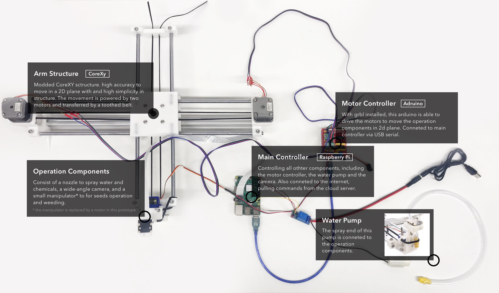
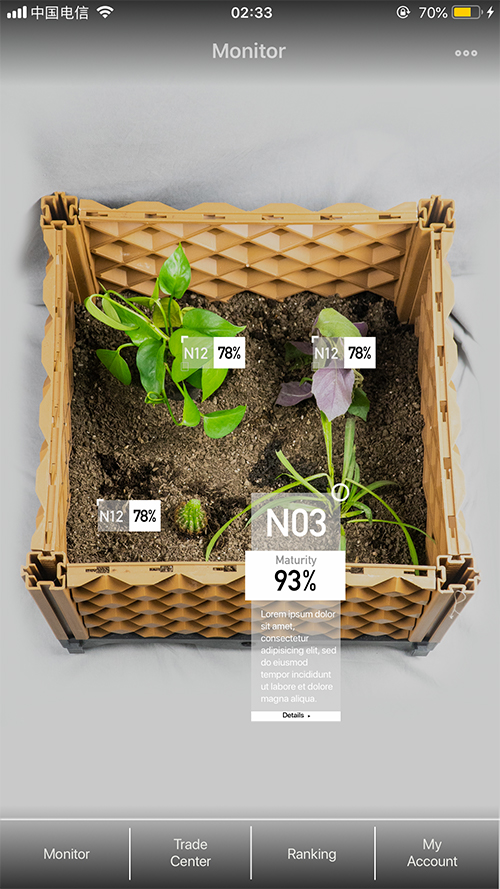

# Vegee (scale prototype)
A remote farm that users can
1. Monitor on their smartphone
2. Control the robot to do the cultivation stuffs



## Server `server2.py`  (Raspberry Pi)
### `/status` method: GET
Get the status and position of the moving components (by communicating with the Arduino with grbl installed)
### `/status?move=[direction]` method: POST
Move the moving components by one step in a certain direction
### `/command` method: PUT
Receiving a JSON that specify the details of the operation.
Sample JSON:
```{
  "type": "sequence",
  "plant_id": 12,
  "do": "water",
  "time": 1544947293
}
```

## Client (smartphone)

A simple prototype build with Cordova
### Key features:
1. Watch live streaming from the camera on the farm
 * WebRTC for low-latency streaming
 * Showing plant anchors when moving the camera by calculating the relative position of the plant to the camera
2. Control the farm robot


## Miscellaneous
## `key-control.py` control the robot with keybords (for debugging)
## `serial-control.py` a simple serial terminal interface for grbl

## Portfolio page
[https://shenghan.site/vegee]

